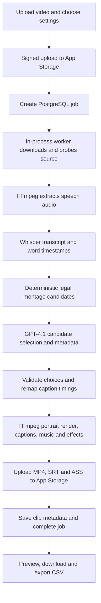

# Yapping Helper

**Turn a long talking-head video into short, captioned vertical clips—with AI-selected moments, optional background music, and subtle effects.**

[Live app](https://yapping-helper.replit.app) · [Latest changes](CHANGELOG.md) · [AI workflow](#is-this-an-agentic-app) · [Roadmap](#future-integrations-and-roadmap)

## What we are building

Creators often have useful ideas buried inside a long recording but still need to find the hook, remove filler, reframe the video, add captions, and prepare downloads. Yapping Helper combines AI editorial selection with a controlled media-rendering pipeline to reduce that manual work.

This is a **hackathon MVP**, not a fully hardened multi-user service. Use non-sensitive footage for the demo; see [limitations](#current-limitations-and-safety).

## Demo video

**Walkthrough recording coming soon.** This section is reserved for the project demo video. No recording has been uploaded yet.

The walkthrough will show uploading a video, choosing clip/caption/music settings, processing, previewing results, and downloading clips or a CSV.

<!-- Add the supplied public recording URL or GitHub-hosted video here when available. -->

## What works today

- Upload MP4, MOV, or WebM videos directly to App Storage.
- Real speech transcription with segment and word timestamps.
- Request 1–10 AI-selected clips, subject to available distinct source material.
- Short, medium, and long duration targets, allowing approximately ±3 seconds.
- Portrait **1080 × 1920 H.264/AAC MP4s**, including HDR-to-SDR conversion.
- Six caption presets: Auto, Educational, Punchy, Storytelling, Interesting, and Opinionated.
- Burned-in styled captions, plus **SRT** and **ASS** downloads. SRT is plain timed text; ASS carries styling.
- Optional **Upbeat** or **Chill** background music, adjustable from 0–25%, with automatic lowering under speech.
- Optional gentle alternating punch-ins and subtle contrast/saturation enhancement.
- Progress reporting, preview playback, source ranges, hooks, and AI editorial rationale.
- Regeneration using a cached transcript where valid.
- CSV export with clip metadata and absolute MP4, SRT, ASS, and results links.
- Confirmed deletion of the current job and associated media/transcript.

## Is this an agentic app?

**The precise description is an AI-guided, bounded editing workflow—not an autonomous multi-agent system.**

The model makes an editorial decision: which valid montage to use and how to describe it. Application code controls the sequence of steps, available choices, timing, storage, and rendering.

| Capability | Used here? | What actually happens |
|---|---|---|
| Speech recognition | Yes | OpenAI Whisper returns transcript and timestamps. |
| LLM editorial selection | Yes | GPT-4.1 selects one legal candidate per clip and writes metadata. |
| Structured model output | Yes | Strict JSON Schema constrains the candidate ID and required fields. |
| Model-driven function/tool calling | No | The model does not invoke FFmpeg, storage, shell commands, or APIs. |
| Autonomous plan → act → observe loop | No | A fixed application workflow runs each stage. |
| Multiple cooperating AI agents | No | No multi-agent runtime is used by the app. |
| RAG, vector database, or web search | No | Selection uses the current video's transcript. |
| LangChain, LangGraph, or an agent SDK | No | The backend calls the OpenAI SDK directly. |

The useful separation is **AI for subjective editing choices; deterministic code for timing and execution**. Calling this an “autonomous video editor agent” would overstate the current implementation.

### Exact AI API calls

Implementation: [`yappingProcessor.ts`](artifacts/api-server/src/lib/yappingProcessor.ts).

**1. Transcription**

```ts
client.audio.transcriptions.create({
  file: createReadStream(audio),
  model: "whisper-1",
  response_format: "verbose_json",
  timestamp_granularities: ["segment", "word"],
});
```

- FFmpeg first extracts mono 16 kHz MP3 speech audio.
- Whisper supplies real transcript text and segment/word timestamps.
- The normalized transcript is stored in PostgreSQL and can be reused on regeneration.
- The AI provider receives audio for this step—not just an on-device transcript.

**2. Montage selection and metadata**

```ts
client.chat.completions.create({
  model: "gpt-4.1",
  // Other request fields omitted here; see the processor for the complete call.
  response_format: {
    type: "json_schema",
    json_schema: {
      name: "candidate_selection",
      strict: true,
      schema: {
        type: "object",
        additionalProperties: false,
        required: ["candidateId", "title", "hook", "reason"],
        properties: {
          candidateId: { type: "string", enum: availableCandidateIds },
          title: { type: "string" },
          hook: { type: "string" },
          reason: { type: "string" },
        },
      },
    },
  },
});
```

- Deterministic code builds legal montage candidates from transcript segments and words.
- GPT-4.1 receives candidate transcripts and editing-style instructions.
- It selects a candidate ID and writes the title, hook, and rationale.
- It **does not invent output timestamps**. The server resolves the selected ID to validated source ranges.
- Candidate compatibility checks preserve enough distinct material for remaining clips.
- The prompt treats spoken instructions as untrusted source content.
- For **N clips**, the normal first-run path makes **one transcription request plus N selection requests**; SDK retries can increase actual API requests. Regeneration can skip transcription when the cache is valid.

No AI music or image-generation service is called. The two bundled music loops are synthesized by project code, and effects/captions are rendered with FFmpeg.

## How the pipeline works



The frontend polls progress approximately every two seconds. Rendering stages use temporary files; finished media is uploaded to App Storage, while PostgreSQL stores job state, transcripts, source ranges, and clip metadata.

### Music, effects, and captions

- **Music:** original deterministic stereo WAV loops; not streamed from a commercial music catalog.
- **Mixing:** quiet backing track, sidechain ducking from speech, a limiter, and an end fade.
- **Effects:** restrained alternating crops/punch-ins and slightly richer color—not generative video or complex animated transitions.
- **Captions:** generated from remapped word timestamps and burned from ASS after the video crop, so the text remains consistently positioned.
- **Output:** 30 fps, H.264 video, AAC audio, and web-friendly MP4 fast start.

Relevant code: [`yappingRender.ts`](artifacts/api-server/src/lib/yappingRender.ts), [`captionStyles.ts`](artifacts/api-server/src/lib/captionStyles.ts), and [`generate-music.mjs`](artifacts/api-server/scripts/generate-music.mjs).

## Tech stack

Versions below are resolved in the committed lockfile, rather than just broad dependency ranges. `ffmpeg-static` and `ffprobe-static` versions are package versions, not the underlying executable release numbers.

| Layer | Technology | Role |
|---|---|---|
| Workspace | pnpm workspaces, TypeScript **5.9.3** | Shared types and monorepo tooling |
| Frontend | React **19.1.0**, Vite **7.3.6** | Interactive uploader, progress, results |
| Styling/UI | Tailwind CSS **4.3.3**, Radix UI primitives, Lucide icons | Accessible controls and styling |
| Client data | TanStack React Query **5.102.8**, Wouter **3.11.0** | API state, polling, routing |
| Animation | Framer Motion **12.43.0** | Frontend motion support |
| API | Node.js ESM, Express **5.2.1** | Upload/job/download endpoints |
| AI client | OpenAI SDK **7.18.0** | `whisper-1` and `gpt-4.1` calls |
| Validation/contracts | OpenAPI, Orval **8.30.0**, Zod **3.25.76** | Generated React client and request validation |
| Database | PostgreSQL, Drizzle ORM **0.45.2**, `pg` **8.23.0** | Jobs, transcripts, and clips |
| Schema tooling | Drizzle Kit **0.31.10** | Database schema management |
| Media processing | `ffmpeg-static` **5.3.0**, `ffprobe-static` **3.1.0** | Probe, trim, concat, tone-map, caption, mix, encode |
| File storage | Replit App Storage, `@google-cloud/storage` **8.2.0** | Signed uploads and stored media |
| Logging/build | Pino **9.14.0**, esbuild | API logs and production server bundle |
| Hosting | Replit artifact routing and publishing | Frontend at `/`, API at `/api`. **Reserved VM required** (not Autoscale) |

## Repository map

```text
artifacts/
  yapping-helper/       React frontend and client-side CSV export
  api-server/           Express routes, AI workflow, FFmpeg renderer
    assets/fonts/       Bundled caption fonts and their licenses
    assets/music/       Required Upbeat and Chill WAV loops
    scripts/            Deterministic music generation
  mockup-sandbox/       Design-preview workspace
lib/
  api-spec/             OpenAPI contract and Orval configuration
  api-client-react/     Generated API hooks and fetch client
  api-zod/              Generated request validators/types
  db/                   PostgreSQL connection and Drizzle schema
scripts/                Workspace helper scripts
```

## Development and configuration

The project targets **Linux and Replit's artifact-based runtime**. It is not a zero-configuration standalone deployment.

1. Install dependencies with `pnpm install`.
2. Configure a development PostgreSQL database, App Storage, and OpenAI credentials through secrets—not checked-in files.
3. For a new development database, review the schema and run `pnpm --filter @workspace/db push`. This changes database structure; do not point it at production casually.
4. Start the configured Replit workflows, or use separate terminals:

```sh
pnpm --filter @workspace/api-server run dev
pnpm --filter @workspace/yapping-helper run dev
```

The API's development command builds before starting; restart it after backend edits. The frontend uses Vite. The workspace routes frontend requests and `/api` on the same origin.

| Variable | Purpose |
|---|---|
| `OPENAI_API_KEY` | OpenAI transcription and selection calls |
| `DATABASE_URL` | PostgreSQL connection |
| `DEFAULT_OBJECT_STORAGE_BUCKET_ID` | Configured App Storage bucket |
| `PRIVATE_OBJECT_DIR` | Private object-storage path |
| `PUBLIC_OBJECT_SEARCH_PATHS` | Public-object lookup paths where used |
| `PORT` | Per-service listening port |
| `BASE_PATH` | Frontend artifact base path; `/` for this app |

Replit supplies storage runtime identity. Outside Replit, adapt that authentication and the same-origin routing; setting environment names alone is insufficient.

### Checks and builds

```sh
pnpm run typecheck
pnpm --filter @workspace/yapping-helper test
pnpm --filter @workspace/api-server run build
PORT=20200 BASE_PATH=/ pnpm --filter @workspace/yapping-helper run build
```

After changing the API contract:

```sh
pnpm --filter @workspace/api-spec run codegen
```

Production settings live in each artifact's `.replit-artifact/artifact.toml`. The API build copies fonts and music into its output. Keep packaged FFmpeg/FFprobe dependencies available in production; a development machine's system binaries are not enough.

**Published hosting must be a Reserved VM, not Autoscale.** Clip rendering runs in-process with FFmpeg. Autoscale (Cloud Run) can freeze CPU between HTTP requests, scale the worker to zero, and OOM HDR encodes. `.replit` is set to `deploymentTarget = "gce"`. After pulling this change, open Replit Publish → Adjust settings, choose **Reserved VM**, pick at least **1 vCPU / 2 GB RAM** (2 vCPU / 4 GB is safer for HDR iPhone footage), and republish.

## Verification performed

During implementation, API/frontend type checks and production builds passed, along with CSV and renderer-helper unit tests. A **14.72-second enhanced clip from real HDR MOV footage** passed playback, seeking, MP4/SRT/ASS downloads, reload, CSV export, and full FFmpeg decode.

This is implementation evidence—not a complete security audit or a claim that every input/hosting failure has been tested.

## Current limitations and safety

- **No end-user sign-in or job ownership checks yet.** Anyone who obtains a job ID/link may be able to access or modify that job. Do not upload confidential footage, and do not treat random IDs as authentication.
- **No per-user rate limiting or usage quotas yet.** A public instance needs abuse and cost controls before broad use.
- **The render queue is in process memory.** It handles jobs serially; restart/crash recovery and durable distributed workers are not implemented in this snapshot. Cached transcripts help normal retries, not recovery of a lost queue. Incomplete jobs are re-queued when the API process starts.
- **Do not publish on Replit Autoscale.** Autoscale is request-scoped and too small for HDR FFmpeg. Use a Reserved VM.
- Sources longer than **20 minutes** are rejected. Clip count and duration remain constrained by available distinct spoken material.
- Video analysis is **transcript-driven**; the model does not visually inspect every frame. Framing uses crops rather than face tracking.
- AI-selected highlights and metadata are suggestions. Review them for context and accuracy before posting.
- “Connect Instagram” is currently disabled. No automatic social publishing or Google Sheets OAuth integration is implemented.
- CSV links use the exporting app's address. Export from the published app for production links; deletion/regeneration can invalidate previous links.
- Audio and candidate transcript content are sent to OpenAI. Get the necessary consent and rights before uploading media.

## Future integrations and roadmap

These are **proposed next steps, not working features or connected services**.

| Priority | Next step | What it would add |
|---|---|---|
| Before broad public use | Sign-in, ownership checks, rate limits, usage quotas | Isolated user projects and abuse/cost protection |
| Reliability | Durable queue, restart recovery, cleanup monitoring | Resume interrupted processing and track failures |
| Creator workflow | Instagram Reels, YouTube Shorts, TikTok | Reviewed publishing flows using official APIs, OAuth, and required platform permissions |
| Organization | Google Sheets, Drive, Notion | Send clip metadata or exports directly instead of manual CSV import |
| Editorial control | Candidate preview, transcript editing, manual trim controls | Human approval before expensive final renders |
| Branding | Brand kits and licensed music uploads | User-controlled typography, colors, and permitted audio |
| Framing | Face/speaker tracking | Smarter crops for interviews and multi-person recordings |
| Optional agentic extension | Bounded planner + preview/evaluation loop | An AI agent could propose edits, inspect a low-cost render, and request revisions under strict budgets and human approval |

If an agentic extension is added, its tools should be narrowly scoped (select segments, render preview, inspect validation results), with no arbitrary shell execution, bounded iterations, and explicit approval for posting or spending beyond budget.

## Source and media policy

This repository is a clean source snapshot, **not Replit checkpoint history**. User uploads, rendered samples, transcripts, local session data, and secret values are excluded. Required music and fonts are included; font licenses are kept alongside those assets.

A public GitHub repository makes its code and committed history visible to anyone; it does not upload the app's database or private App Storage contents to GitHub.